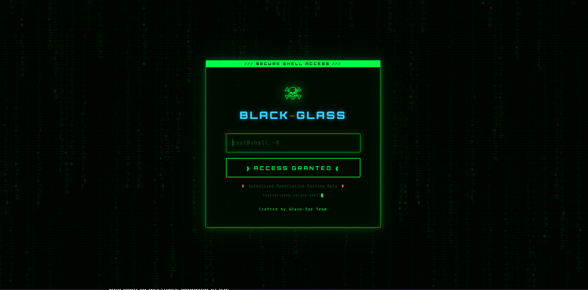
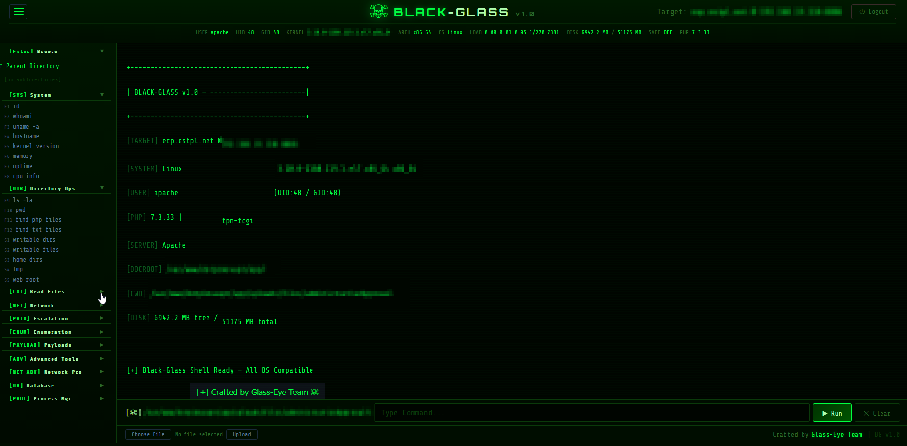

<div align="center">

<pre style="font-size: 10px; line-height: 10px; font-weight: bold; color: #00ff41;">
 ____  _        _    ____ _  __       ____ _        _    ____ ____  
| __ )| |      / \  / ___| |/ /      / ___| |      / \  / ___/ ___| 
|  _ \| |     / _ \| |   | ' / _____| |  _| |     / _ \ \___ \___ \ 
| |_) | |___ / ___ \ |___| . \|_____| |_| | |___ / ___ \ ___) |__) |
|____/|_____/_/   \_\____|_|\_\      \____|_____/_/   \_\____/____/ 
</pre>

**A Next-Generation Post-Exploitation & Authorized Pentesting Web Shell**

[](#)
[](#)
[](#)
[](#)

<br>

<br><br>

*Designed for seamless security assessments, featuring a reactive Matrix-inspired GUI, zero external dependencies, and asynchronous execution.*

</div>

---


## 📖 Table of Contents
- [Overview](#-overview)
- [Core Arsenal](#-core-arsenal)
- [Installation & Deployment](#-installation--deployment)

---

## 👁️‍🗨️ Overview

**BLACK-GLASS** redefines the traditional web shell. Instead of clunky page reloads and basic command inputs, it operates as a full-fledged, single-page application (SPA) running entirely via AJAX. It provides penetration testers and security researchers with a persistent, terminal-like experience directly in the browser, packed with post-exploitation tools that typically require uploading external binaries.

<div align="center">

</div>

---

## ⚡ Core Arsenal

BLACK-GLASS is modular and packed with built-in functionalities designed for rapid enumeration and escalation.

<details>
<summary><b>🛡️ Stealth & Execution Mechanics</b> (Click to expand)</summary>

* **Encrypted Sessions:** Hardcoded SHA-256 password validation with strict 1-hour session timeouts.
* **AJAX Core:** 100% asynchronous execution. No page reloads mean fewer noisy footprint traces in access logs.
* **Smart Execution:** Automatically hunts for the best execution method (`exec`, `shell_exec`, `system`, `passthru`, `popen`, `proc_open`, COM objects) to bypass restrictive `php.ini` configurations.
</details>

<details>
<summary><b>🧰 Advanced GUI Tools</b> (Click to expand)</summary>

* **📁 File System Manager:** Read/Write code editor, Hex dump viewer, ZIP archive creator/extractor, and recursive file/content search.
* **🌐 Network Pro:** Integrated TCP port scanner, WHOIS/DNS lookups, and a built-in **SSRF / HTTP Proxy** tool for pivoting into internal networks.
* **💥 Reverse Shell Generator:** One-click payload generation for Bash, Python3, PHP, Netcat, Perl, and PowerShell.
* **🗄️ Database Browser:** Direct, credential-based SQL query execution for MySQL, PostgreSQL, SQLite, and MSSQL.
* **⚙️ System Admin:** Live Process Manager (list & kill PIDs), Crontab editor, and rapid file-permission modifier.
</details>

---

## 🚀 Installation & Deployment

Deploying BLACK-GLASS requires zero compilation. It is a single-file drop-in.
> [!CAUTION]
> ## ⚖️ STRICT LEGAL DISCLAIMER
> **BLACK-GLASS is developed EXCLUSIVELY for authorized penetration testing, security assessments, and academic research.** 
> 
> You are strictly prohibited from deploying, installing, or utilizing this tool on any system, network, or infrastructure where you do not possess explicit, documented authorization from the owner. Engaging in unauthorized access is a severe criminal offense. 
> 
> By downloading or using this software, you agree that the author (Glass-Eye Team) assumes **zero liability** and is not responsible for any misuse, damage, data loss, or illicit activities facilitated by this tool. **Use at your own risk.**

---

> [!IMPORTANT]  
> 🔑 **DEFAULT CREDENTIALS**  
> **Password:** `admin123`  
> *It is highly critical that you change the SHA-256 hash in the source code before deploying this to any live environment.*

### 1. Secure the Payload (Mandatory)
Open `black-glass.php` and locate the configuration block at the top. Generate a SHA-256 hash of your desired secure password and replace the default hash.

```php
// ============================================================
// PASSWORD PROTECTION — SHA-256 hashed
// Default password is "admin123". CHANGE THIS HASH!
// ============================================================
$CONFIG_PASSWORD_HASH = hash('sha256', 'YOUR_NEW_PASSWORD_HERE');
